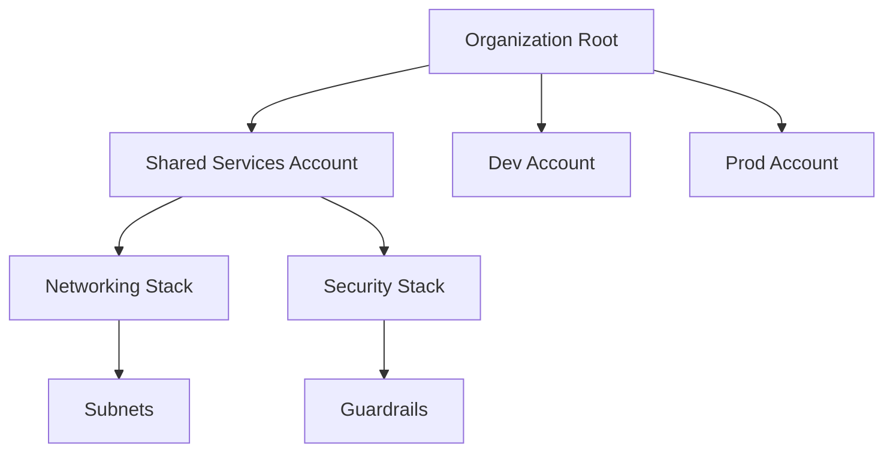

# iac-aws-landing-zone

## What it is
A Terraform-based landing zone baseline for AWS, providing a multi-account architecture with centralized networking, security, and account baseline modules.

## Why it exists
To standardize AWS account setup and accelerate provisioning with infrastructure-as-code. It helps enforce security best practices and provides a compliant, scalable foundation.

## Architecture


## Quickstart
1. Clone the repository.
2. Install Terraform (version >= 1.5).
3. Navigate to the appropriate environment (e.g., `environments/dev`).
4. Run `terraform init`, `terraform plan`, and `terraform apply`.

## Usage examples
- Provision the landing zone in development:
  ```bash
  cd environments/dev
  terraform init
  terraform apply
  ```
- Customize the account baseline by adjusting variables in `environments/dev/main.tf`.

## Roadmap
- Add support for Control Tower integration.
- Module for centralized logging.
- Expand to include additional security services.

## Security notes
- No AWS credentials are stored in this repository.
- Always review and comply with your organization's security policies before deployment.
