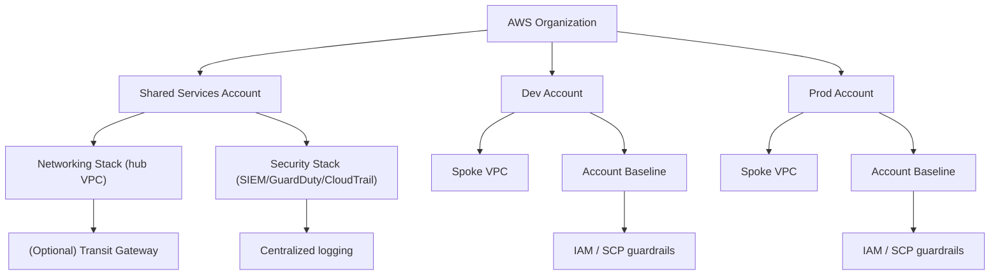

# iac-aws-landing-zone

[](https://developer.hashicorp.com/terraform)
[](https://aws.amazon.com/)
[](LICENSE)
[](docs/architecture.md)
[](docs/modules.md)

A Terraform-based landing zone baseline for AWS, providing a multi-account architecture with centralized networking, security, and account baseline modules. The repo favors production-ready defaults (encryption, logging, tagging) with clear hand-offs for platform and application teams.

## Table of contents
- [What it is](#what-it-is)
- [Why it exists](#why-it-exists)
- [Architecture](#architecture)
- [Repository layout](#repository-layout)
- [Prerequisites](#prerequisites)
- [Getting started](#getting-started)
- [Working with environments](#working-with-environments)
- [Modules](#modules)
- [Quality gates](#quality-gates)
- [Security & compliance](#security--compliance)
- [Documentation](#documentation)
- [Contributing](#contributing)
- [Troubleshooting](#troubleshooting)
- [License](#license)

## What it is
A production-ready AWS landing zone template. It codifies organizational guardrails, baseline controls, shared networking, and common security services so teams can provision accounts quickly without re-inventing foundations. Out of the box, it bootstraps:

- Account baselines with organization-wide tagging strategy, CloudTrail + S3 logging, and AWS Config.
- Networking with VPCs, subnets, flow logs, optional NAT gateways, and Transit Gateway hooks.
- Security primitives including GuardDuty, Security Hub standards, and cross-account aggregation patterns.

## Why it exists
- Standardize AWS account setup and accelerate provisioning with infrastructure-as-code.
- Enforce security best practices and provide a compliant, scalable foundation.
- Reduce drift by centralizing configuration, reusable modules, and opinionated defaults.
- Support repeatable, multi-account deployments with clear environment separation.
- Give platform teams a sharable baseline that application teams can consume with minimal ceremony.

## Architecture


- Multi-account structure under AWS Organizations with clear separation of duties.
- Centralized networking and security services in a shared services account.
- Environment spokes (dev/prod) with account baselines, IAM guardrails, and pluggable modules (networking, security).
- Remote state backed by S3/KMS (recommended) with workspace isolation.

For deeper design notes, see [docs/architecture.md](docs/architecture.md).

## Repository layout
- `environments/` — Environment entrypoints (dev, prod) that compose modules and set provider regions.
- `modules/`
  - `account-baseline/` — Central logging bucket, CloudTrail, AWS Config, and tagging strategy, plus inputs/outputs docs.
  - `networking/` — VPC, subnets, routing, VPC endpoints, VPC flow logs, optional NAT gateways, and Transit Gateway hooks.
  - `security/` — GuardDuty, Security Hub, default standards subscriptions, and optional delegated admin setup.
- `policies/` — Organization and IAM policies to attach across accounts.
- `scripts/` — Helper automation (e.g., `deploy.sh` for a validate/plan/apply flow).
- `docs/` — Architecture overview, module reference (`docs/modules.md`), and ADRs (`docs/decisions`) for design history.

## Prerequisites
- Terraform **>= 1.5** (use `tfenv` or `asdf` for version pinning).
- AWS CLI configured with profiles that map to each account (e.g., `shared`, `dev`, `prod`).
- Access to create/read S3 buckets and KMS keys for remote state (or update the backend accordingly).
- (Optional) `tflint`, `checkov`, and `pre-commit` if you enable additional linters/hooks locally.

## Getting started
1. **Clone** the repository and choose an environment (e.g., `environments/dev`).
2. **Configure backend** (recommended): create an S3 bucket and KMS key for remote state, then add a `backend.tf` file per environment, e.g.:
   ```hcl
   terraform {
     backend "s3" {
       bucket         = "my-landing-zone-state"
       key            = "dev/terraform.tfstate"
       region         = "us-east-1"
       dynamodb_table = "terraform-locks"
       encrypt        = true
     }
   }
   ```
3. **Set AWS credentials** for the target environment (profile or role assumption). Confirm access with `aws sts get-caller-identity`.
4. **Initialize and validate**:
   ```bash
   cd environments/dev
   terraform init
   terraform fmt -recursive
   terraform validate
   ```
5. **Plan and apply**:
   ```bash
   terraform plan -out=tfplan
   terraform apply tfplan
   ```
6. Use `./scripts/deploy.sh` for a scripted init/fmt/validate/plan/apply sequence (arguments are forwarded to `terraform plan`).
7. **Tagging**: supply the required `tags` variable (key/value map) so resources carry organization metadata (owner, cost center, environment). Tag validation happens at module boundaries.
8. **Observability**: ensure the logging bucket from `account-baseline` is reachable from spoke accounts; CloudTrail and Config delivery require bucket policy updates if you change defaults.

## Working with environments
Each environment is isolated and can point at a distinct AWS account or workspace.

| Environment | Purpose                  | Default region | Notes |
|-------------|-------------------------|----------------|-------|
| `dev`       | Sandboxed development    | `us-east-1`    | Safe place to iterate; adjust region as needed. |
| `prod`      | Production workloads     | `us-east-2`    | Hardened settings and stricter guardrails are expected. |

Guidance:
- Keep variables and provider settings environment-specific; avoid cross-environment drift.
- Prefer Terraform workspaces only when multiple instances share the same backend; otherwise use separate state buckets.
- Update TODOs in `main.tf` files with real module inputs before applying.
- Pin provider versions in each environment to avoid unintended upgrades and consult the AWS provider changelog.
- Keep state isolation strict: never point multiple environments to the same `key` in the backend.

## Modules
- **Account baseline**: organization tags, SCPs, IAM guardrails, foundational logging, and shared tagging strategy.
  - Creates S3 logging bucket with KMS encryption, lifecycle policies, and access logging.
  - Configures organization-wide CloudTrail across regions and wires AWS Config to the same bucket.
  - Enforces a tagging map that other modules reuse for consistent metadata.
- **Networking**: opinionated VPC topology (private/public subnets, NAT, routing), plus optional Transit Gateway connectivity.
  - Builds VPC with optional IPv6, AZ-aware subnet creation, and flow logs to CloudWatch or S3.
  - Allows NAT to be disabled for cost-sensitive environments; exposes route table IDs as outputs.
  - Integrates easily with TGW attachments via exported subnet IDs.
- **Security**: GuardDuty, AWS Config, CloudTrail aggregation, and hooks for SIEM/alerting integrations.
  - Enables GuardDuty/Security Hub with CIS/FSBP standards, supports delegated admin, and exports detector IDs.
  - Optional aggregation account flow lets you centralize findings across multiple target accounts.

Modules are designed to be composable; environments wire them together with environment-specific variables and providers. See `modules/*/README.md` for full inputs/outputs.

### Module quickstart
```bash
# Example: stand up a dev spoke using the shared modules
cd environments/dev
terraform init
terraform apply -var="vpc_cidr=10.10.0.0/16" -var-file="dev.auto.tfvars" -auto-approve
```

Key variables to set per module (see docs/modules.md for full tables):
- `tags` (all modules) — required map of organizational metadata.
- `vpc_cidr`, `public_subnet_cidrs`, `private_subnet_cidrs` (networking) — choose non-overlapping CIDRs.
- `security_hub_enable_cis`, `security_hub_enable_fsbp` (security) — toggle default standards.
- `cloudtrail_trail_name`, `config_bucket_name` (account-baseline) — override naming if your org has naming policies.

## Quality gates
- Format: `terraform fmt -recursive`
- Validation: `terraform validate`
- Linting (optional): `tflint --recursive` and `checkov -d .`
- Planning/apply: `terraform plan` / `terraform apply`
- Scripted flow: `./scripts/deploy.sh` (runs init, fmt-check, validate, plan, apply)

Recommended CI stages:
- **fmt**: fail the pipeline if formatting is required.
- **validate**: static validation against the configured provider versions.
- **plan**: produce and upload a JSON plan artifact for review.
- **policy** (optional): gate with `tflint`/`checkov` or organization-specific OPA policies.

Consider adding `tflint` and `checkov` in CI for policy-as-code scanning. GitHub Actions or another pipeline should block merges on fmt/validate/plan.

## Security & compliance
- No AWS credentials are stored in this repository.
- Prefer short-lived credentials via SSO or role assumption; avoid long-lived access keys.
- Store state in an encrypted S3 bucket with DynamoDB locking and a CMK.
- Apply least-privilege IAM policies when running Terraform (separate read-only plan role vs. apply role is ideal).
- Keep sensitive variables in a secure store (e.g., SSM Parameter Store, Secrets Manager, Vault) and load via environment variables or `-var-file` that stays outside version control.
- Enable CloudTrail encryption by default and ensure S3 access logging is turned on for the logging bucket.
- Security Hub and GuardDuty detectors can be delegated to a central account—use the `security` module inputs to opt in.
- Consider attaching SCPs from `policies/` to enforce preventative controls (e.g., block public S3, require EBS encryption).
- Rotate KMS keys and review bucket lifecycle policies to align with your data retention requirements.

## Operations runbook (starter)
- **Bootstrap**: create remote-state bucket/DynamoDB table, then run `terraform init` per environment.
- **Day-2 config changes**: adjust module variables in the environment `main.tf` and re-run `terraform plan/apply` with the same backend configuration.
- **Drift detection**: schedule `terraform plan` (read-only role) nightly and alert on non-empty plans.
- **Audit logging**: periodically verify CloudTrail delivery to the logging bucket and Config recorder status via `aws configservice describe-configuration-recorders`.
- **Incident response**: centralize GuardDuty/Security Hub findings in the designated aggregation account and wire notifications to your SIEM.

## Documentation
- High-level architecture: [docs/architecture.md](docs/architecture.md)
- Module reference and examples: [docs/modules.md](docs/modules.md)
- Architecture decision records: [docs/decisions](docs/decisions)
- CHANGELOG entries should summarize user-impacting changes per release.

## Contributing
- Create a branch per change; keep commits scoped and descriptive.
- Run `terraform fmt` and `terraform validate` locally before opening a PR.
- If introducing a major design change, add an ADR under `docs/decisions`.
- Include diagrams or runbooks in `docs/` when altering architecture or operations.

## Troubleshooting
- **"No valid credential sources"**: verify your AWS profile/role; run `aws sts get-caller-identity`.
- **State lock stuck**: clear the lock in DynamoDB or use `terraform force-unlock` with care.
- **Plan/apply drift**: ensure you are in the right environment directory and backend before applying.
- **Provider region mismatch**: align the `provider "aws"` region with the account/region you intend to modify.

## License
MIT License. See [LICENSE](LICENSE) for details.
