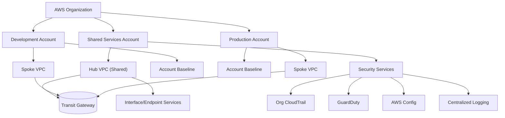

# Architecture

## High-level diagram

## Responsibilities by layer
- **Organization**: Root-level policies, account vending, tagging standards, and SCP guardrails enforced consistently.
- **Shared Services account**: Hub-and-spoke networking (Transit Gateway, VPC endpoints), centralized DNS, logging/KMS, and SIEM integrations.
- **Environment accounts (dev/prod)**: Spoke VPCs, environment-specific baselines (IAM boundaries, tagging, quotas), and workload-specific networking overlays.
- **Security services**: Organization-wide CloudTrail, GuardDuty, and Config with aggregation in the shared security account; security findings forwarded to your SIEM or ticketing system.

## State and isolation
- Recommended to store Terraform state in an encrypted S3 bucket per environment with DynamoDB state locking.
- Use dedicated AWS roles or profiles per environment (e.g., read-only for `plan`, elevated for `apply`).
- Avoid sharing state across accounts; treat each environment directory as an isolated deployment unit.

## Network topology
- Hub VPC (shared services) provides shared endpoints, directory/KMS, and optional Transit Gateway for spoke connectivity.
- Spoke VPCs (dev/prod) host workloads; route selectively through Transit Gateway or VPC peering depending on isolation requirements.
- Centralized egress via NAT gateways in the hub can be enabled to consolidate inspection points.

## Security and compliance
- Baseline modules attach SCPs and IAM boundaries to enforce least-privilege and restrict destructive actions in production.
- GuardDuty and AWS Config are enabled per account with findings aggregated centrally.
- Organization CloudTrail delivers to a secure S3 bucket with KMS encryption and bucket policies locked to security principals.
- Logs can be forwarded to downstream systems (SIEM/observability) via Kinesis Firehose or EventBridge pipes.

## Operations
- Deploy via Terraform in each `environments/` directory; prefer remote state and locked workspaces.
- Automated checks should run `terraform fmt`, `terraform validate`, and `terraform plan`. Additional scanners like `tflint` and `checkov` can block policy violations.
- Major architectural changes should be captured as ADRs in `docs/decisions` to preserve rationale.
